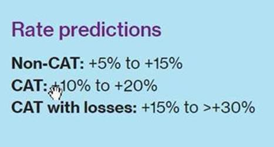

# ismr19
## Introduction
The Goal of this exercise is to download the document from the link- https://www.willistowerswatson.com/en-US/Insights/2019/11/insurance-marketplace-realities-2019-fall-update-executive-summary and data from the document needs to be put into a structured format (excel sheet). Following data need to be captured along with an extra `line of business` column.



## How to setup and run
1. Clone the project/ or download the project as a zip file
2. cd into the project
    ```bash
    cd ismr19
    ```
3. Now, I recommend two ways to setup the project-
    1. Docker- There is Dockerfile in the directory
        ```bash
        # replace <tag> with your own tag name
        docker build -t <tag> .
        ```
        As the image creates two folder `/ismr19/src/data` containing the document, and `/ismr19/src/report` containing the excel report use `--mount` to mount host directory to container's directory
        ```bash
        # make data and report directory if it does not exists
        mkdir data
        mkdir report
        ```
        ```bash
        # replace <tag> with the tage name used in the previous command
        docker run --mount type=bind,source="$(pwd)"/data,target=/ismr19/src/data --mount type=bind,source="$(pwd)"/report,target=/ismr19/src/report -t <tag>
        ```
    2. Using conda environment- Create a `conda` environment with `python=3.7.6`
        ```bash
        # replace <env-name> with your own environment name, e.g.- "py376", "ismr19" etc.
        conda create -n <env-name> python=3.7.6
        conda activate <env-name>
        ```
        Now refer the following link to setup `poppler` https://pypi.org/project/pdftotext/
        
        Now install the required dependencies using `pip`
        ```bash
        pip install -r src/requirements.txt
        ```
        To run the application
        ```bash
        cd src
        python run.py
        ```
4. For both ways, there will be two folders created `data` and `report`
    1. Docker way-
        1. `data` folder in `/ismr19/data`
        2. `report` folder in `/ismr19/report`
    2. Conda way-
        1. `data` folder in `/ismr19/src/data`
        2. `report` folder in `/ismr19/src/report`
    
    The `data` folder contains `insurance-marketplace-realities-fall-2019.pdf` file -> the document

    The `report` folder contains `report.xlsx` file -> the report